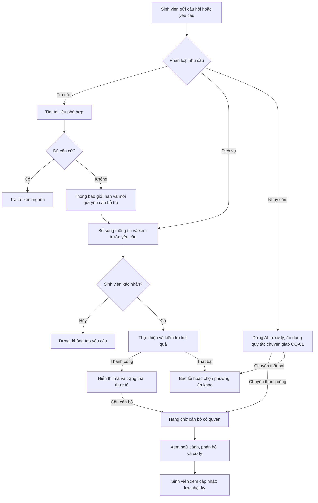

# Tài liệu Yêu cầu Nghiệp vụ (BRD) — Campus 24/7

## 1. Thông tin tài liệu

| Thuộc tính | Nội dung |
|---|---|
| Dự án | Campus 24/7 — Trợ lý AI Vận hành Học vụ 24/7 |
| Mã đề / Kho dự án | EDU-14 / P-120 |
| Phiên bản | 0.1 |
| Ngày lập | 18/09/2026 |
| Trạng thái | Bản dự thảo tổng hợp từ tài liệu hiện có, chờ nhóm rà soát |
| Nhóm thực hiện | Đặng Quang Huy, Hoàng Quốc Dũng, Dương Xuân Vinh, Lê Trung Kiên |
| Đầu mối rà soát nghiệp vụ đề xuất | Đặng Quang Huy, theo phân công phụ trách sản phẩm và hợp nhất tài liệu |
| Phạm vi tài liệu | Nhu cầu nghiệp vụ và tiêu chí chấp nhận của MVP; làm cơ sở hoàn thiện PRD, UI Flow và kiểm thử |
| Môi trường áp dụng | Bản demo dùng tài liệu công khai đã xác minh và dữ liệu nghiệp vụ giả lập |

BRD mô tả **vì sao cần sản phẩm, cần đáp ứng nghiệp vụ nào và đánh giá thành công ra sao**. Chi tiết API, mô hình dữ liệu kỹ thuật và kiến trúc triển khai nằm trong [PRD](02-prd.md). Tài liệu này không xác nhận tính năng đã được xây dựng hoặc chỉ số đã đạt.

### 1.1. Tài liệu nguồn và nguyên tắc tổng hợp

| Mã | Tài liệu | Nội dung được sử dụng |
|---|---|---|
| S01 | [Brief dự án](01-brief.md) | Bài toán, người dùng, phạm vi MVP, chỉ số chính |
| S02 | [PRD Gate 1](02-prd.md) | User stories, xác nhận, handover, trạng thái và dữ liệu nghiệp vụ |
| S03 | [UI Flow](03-ui-flow.md) | Hành trình sinh viên/cán bộ, màn hình và nhãn trạng thái |
| S04 | [Đặc tả wireframe](wireframe-spec.md) | Trạng thái lỗi, hiển thị dữ liệu giả lập, dừng AI sau handover |
| S05 | [Mô tả sản phẩm EDU-14](../reference/MO-TA-SAN-PHAM-EDU-14.md) | Quy trình hiện tại, giá trị, giới hạn vận hành, KPI và lộ trình dự kiến |
| S06 | [Tổng quan EDU-14 Campus 24/7](../reference/EDU-14-Campus-24-7.md) | Đề bài, nghiệp vụ đặt phòng, dữ liệu, đánh giá và phạm vi |
| S07 | [Khác biệt với kỳ trước](../reference/EDU-14-KHAC-BIET-KY-TRUOC.md) | Yêu cầu vận hành ticket, hai vai trò, HITL và audit |
| S08 | [Kế hoạch Gate 1](../reference/EDU-14-Gate-1-Plan.md) | Hồ sơ, phạm vi cốt lõi, cách phân quyền cán bộ chuyên trách |
| S09 | [Phân công nhiệm vụ](Phan-cong-nhiem-vu.md) | Trách nhiệm của bốn thành viên trong giai đoạn Gate 1 |

Nguyên tắc biên soạn: dùng S01–S04 làm cơ sở mô tả phạm vi và hợp đồng Gate 1; dùng S05–S08 bổ sung bối cảnh và nhu cầu nghiệp vụ. Đây là cách tổng hợp của bản dự thảo, không phải quyết định thay thế tài liệu đã được nhóm phê duyệt. Những khác biệt ảnh hưởng triển khai được ghi tại mục 13; các lựa chọn bổ sung được gắn nhãn **Đề xuất** hoặc **Cần xác nhận**.

Các ví dụ về điều khoản, thời gian cấp giấy, giờ sử dụng phòng hoặc số liệu demo trong tài liệu nguồn không được coi là quy định của một trường thật. BRD chỉ tổng hợp nguồn nội bộ, chưa xác minh các nguồn công khai bên ngoài được nhắc đến trong đó.

### 1.2. Thuật ngữ

| Thuật ngữ | Ý nghĩa trong BRD |
|---|---|
| MVP | Phiên bản tối thiểu phục vụ kiểm chứng nghiệp vụ và trình diễn |
| Ticket | Hồ sơ yêu cầu hỗ trợ có mã, người gửi, nội dung và trạng thái |
| Citation | Trích dẫn cho phép đối chiếu câu trả lời với tài liệu, điều/mục hoặc trang nguồn |
| RAG / KB | Tra cứu kho tri thức để tạo câu trả lời dựa trên tài liệu |
| HITL | Con người tham gia xác nhận hoặc xử lý tại các bước cần kiểm soát |
| Handover | Chuyển yêu cầu và ngữ cảnh hội thoại sang cán bộ có thẩm quyền |
| SLA | Cam kết thời gian phục vụ; chưa có SLA cán bộ được phê duyệt cho dự án |

## 2. Tóm tắt nhu cầu nghiệp vụ

Campus 24/7 hỗ trợ sinh viên tra cứu quy chế và gửi yêu cầu học vụ ngoài giờ hành chính. Hệ thống cần nối liền việc hỏi thông tin, kiểm tra nội dung trước khi gửi và theo dõi xử lý trên cùng một hành trình. Cán bộ tiếp nhận các yêu cầu cần người giải quyết qua hàng chờ có phân loại, mức ưu tiên và ngữ cảnh.

Giá trị kỳ vọng gồm: giảm thời gian chờ để được hướng dẫn hoặc tiếp nhận hồ sơ; giảm câu hỏi lặp lại cho cán bộ; tăng khả năng kiểm chứng thông tin; và giúp các trường hợp nhạy cảm được chuyển đúng người. Các giá trị này cần được đo trong thử nghiệm, chưa có số liệu chứng minh hiệu quả tại trường thật.

Tên gọi “24/7” thể hiện định hướng tra cứu và tiếp nhận tự động ngoài giờ. Tên gọi này không đồng nghĩa cán bộ trực liên tục, yêu cầu được phê duyệt ngay hoặc hệ thống đã có cam kết độ sẵn sàng 24/7.

## 3. Bối cảnh và quy trình hiện tại (As-Is)

Theo S01 và S05, quy trình điển hình đang được dùng làm giả định bài toán:

1. Sinh viên tìm thông tin trên website, PDF, nhóm lớp hoặc hỏi người quen.
2. Nếu không xác định được điều khoản áp dụng, sinh viên chờ giờ hành chính để hỏi cán bộ.
3. Sinh viên gửi email, điền biểu mẫu hoặc đến quầy để yêu cầu dịch vụ.
4. Cán bộ tra quy chế, kiểm tra thông tin và chuyển yêu cầu đến bộ phận liên quan.
5. Sinh viên chờ phản hồi, khó theo dõi trạng thái giữa các bước.

| Vấn đề | Tác động nghiệp vụ | Nhu cầu cần đáp ứng |
|---|---|---|
| Hỗ trợ phụ thuộc giờ làm việc | Chậm được hướng dẫn và tiếp nhận yêu cầu | Có kênh tra cứu, gửi yêu cầu ngoài giờ |
| Thông tin phân tán | Khó tìm đúng quy định và đối chiếu câu trả lời | Trả lời kèm nguồn có thể kiểm tra |
| Câu hỏi lặp lại | Cán bộ mất thời gian cho nội dung phổ biến | Tự phục vụ đối với nội dung đã có tài liệu |
| Hồ sơ thiếu dữ liệu hoặc gửi không đúng nơi | Phát sinh trao đổi bổ sung | Thu thập thông tin và xác nhận trước khi gửi |
| Ca nhạy cảm thiếu luồng chuyển tiếp rõ ràng | Có thể bị bỏ sót hoặc AI xử lý vượt thẩm quyền | Chuyển người có ngữ cảnh và giới hạn quyền xem |
| Thiếu trạng thái và lịch sử xử lý | Khó theo dõi trách nhiệm, kết quả | Ticket có tiến độ, phản hồi và nhật ký |

Ví dụ “hỏi lúc 21h, chờ đến 08h hôm sau” trong S05 là tình huống minh họa khoảng chờ 11 giờ. Chưa có khảo sát xác nhận thời gian chờ trung bình, số lượng yêu cầu, chi phí xử lý hoặc mức hài lòng thực tế.

## 4. Mục tiêu nghiệp vụ và lợi ích kỳ vọng

| Mã | Mục tiêu | Biểu hiện thành công | Chỉ số liên quan |
|---|---|---|---|
| BO-01 | Sinh viên tiếp cận thông tin có căn cứ ngoài giờ | Tự hỏi, nhận hướng dẫn và mở được nguồn phù hợp | KPI-01, KPI-02 |
| BO-02 | Tiếp nhận yêu cầu đúng ý định sinh viên | Có bản xem trước, xác nhận và kết quả ghi nhận có thể kiểm tra | KPI-03 |
| BO-03 | Kiểm soát các trường hợp AI không được tự quyết | Chuyển đúng hàng chờ; người có quyền tiếp nhận; AI dừng xử lý nội dung nhạy cảm | KPI-04, KPI-05 |
| BO-04 | Giảm công việc lặp lại và tăng khả năng theo dõi | Cán bộ có tóm tắt, lọc yêu cầu, phản hồi và lưu lịch sử | Chỉ số vận hành đề xuất tại mục 10.2 |
| BO-05 | Chứng minh giải pháp khả thi trong phạm vi khóa học | Web có hai vai trò, ba luồng nghiệp vụ, kiểm thử và kịch bản lỗi | Nghiệm thu mục 12 |

Chưa đặt mục tiêu tiết kiệm tiền hoặc tỷ lệ giảm nhân sự vì không có dữ liệu nền. Tự động tiếp nhận hồ sơ không đồng nghĩa rút ngắn thời hạn xử lý thủ tục do nhà trường quy định.

## 5. Các bên liên quan và trách nhiệm

| Bên liên quan | Nhu cầu / trách nhiệm nghiệp vụ |
|---|---|
| Sinh viên | Hỏi quy chế, kiểm tra nguồn, xác nhận gửi yêu cầu, theo dõi và bổ sung thông tin của mình |
| Cán bộ hỗ trợ học vụ | Tiếp nhận hàng chờ được phân quyền; xem ngữ cảnh; hướng dẫn, yêu cầu bổ sung và hoàn tất xử lý |
| Cán bộ chuyên trách | Xử lý ca nhạy cảm theo thẩm quyền; có thể là nhóm quyền đặc biệt trong vai trò cán bộ theo S08 |
| Đơn vị nghiệp vụ của trường | Xác nhận nguồn quy chế, thẩm quyền, quy trình và thời gian xử lý; chưa có đầu mối trường thật được xác nhận |
| Nhóm phát triển | Xây dựng bản demo, chuẩn bị dữ liệu giả lập, kiểm chứng luồng nghiệp vụ và báo cáo kết quả |
| Giảng viên / hội đồng | Đánh giá phạm vi và kết quả dự án theo yêu cầu khóa học |

Trách nhiệm hiện có của nhóm theo S09: Đặng Quang Huy phụ trách sản phẩm và PRD; Dương Xuân Vinh phụ trách UI/UX và đặc tả dữ liệu/API; Hoàng Quốc Dũng phụ trách AI, RAG, guardrails và chỉ số đánh giá; Lê Trung Kiên phụ trách Brief, repo và hồ sơ Gate 1. Phân công này không thay thế vai trò phê duyệt nghiệp vụ của nhà trường khi triển khai thật.

## 6. Phạm vi

### 6.1. Trong phạm vi MVP

| Hạng mục | Phạm vi nghiệp vụ | Căn cứ |
|---|---|---|
| Hai vai trò người dùng | Sinh viên và cán bộ có giao diện, quyền truy cập phù hợp | S01, S03, S07 |
| Tra cứu quy chế | Hỏi bằng tiếng Việt; trả lời có nguồn; hỏi lại khi mơ hồ; thông báo thiếu căn cứ | S02, S05 |
| Xin giấy xác nhận sinh viên | Tiếp nhận yêu cầu qua chat, xác nhận trước khi tạo ticket; cán bộ tiếp tục xử lý | S01, S02 |
| Đặt phòng tự học | Kiểm tra phòng/khung giờ giả lập, xác nhận, xử lý trùng lịch hoặc hết chỗ | S01, S02, S06, S07 |
| Theo dõi yêu cầu | Sinh viên xem mã, trạng thái và phản hồi đối với yêu cầu của mình | S01, S03 |
| Chuyển giao cán bộ | Chuyển ca nhạy cảm, khiếu nại hoặc ca không đủ cơ sở giải đáp; bàn giao ngữ cảnh | S02, S04 |
| Hàng chờ và xử lý | Cán bộ tìm/lọc, xem chi tiết, phản hồi và cập nhật trạng thái | S02, S03 |
| Kiểm soát và đánh giá | Phân quyền, nhật ký, bộ kiểm thử tra cứu/hành động/an toàn, kịch bản lỗi | S02, S05–S07 |

Đặt phòng được giữ trong phạm vi dự thảo theo Brief và PRD Gate 1. Việc giảm phạm vi tính năng này vẫn cần nhóm xác nhận vì S08 coi đây là tính năng có thể ưu tiên sau, còn S07 yêu cầu có trong demo (OQ-02).

### 6.2. Ngoài phạm vi MVP

- Tự sửa điểm, cấp học bổng, quyết định kỷ luật hoặc thay cơ quan có thẩm quyền phê duyệt.
- Tư vấn tâm lý chuyên sâu, chẩn đoán hoặc điều trị; hệ thống chỉ chuyển tiếp hỗ trợ theo cấu hình được xác minh.
- Kết nối trực tiếp Canvas/LMS, portal đào tạo hoặc cơ sở dữ liệu sinh viên thật.
- Sử dụng hồ sơ cá nhân sinh viên thật trong demo.
- Tự phát hành giấy xác nhận chính thức; MVP tiếp nhận và theo dõi yêu cầu cấp giấy.
- Fine-tune mô hình, triển khai nhiều dịch vụ ngoài học vụ hoặc kiến trúc nhiều tác tử phức tạp chỉ để mở rộng kỹ thuật.

### 6.3. Nhu cầu mở rộng chưa cam kết

Nhắc lịch cá nhân, lịch học, báo sự cố nhiều phòng ban và công cụ cán bộ duyệt nội dung FAQ được nêu trong tài liệu tham khảo nhưng chưa được đặc tả đầy đủ trong PRD Gate 1. BRD ghi nhận chúng là nhu cầu mở rộng cần đánh giá sau hoặc xác nhận riêng, không tự bổ sung vào cam kết MVP.

## 7. Quy trình nghiệp vụ mục tiêu (To-Be)

### 7.1. Tra cứu có nguồn

Sinh viên hỏi quy chế hoặc thủ tục. Hệ thống làm rõ câu hỏi nếu thiếu ngữ cảnh, tra nguồn và trả lời ngắn gọn kèm tên tài liệu, điều/mục và đường dẫn hoặc trang tham chiếu. Nếu không đủ nguồn hoặc quy định không rõ, hệ thống nói rõ giới hạn và đề nghị cán bộ hỗ trợ. Đề nghị hỗ trợ chưa đồng nghĩa ticket đã được tạo.

### 7.2. Tiếp nhận yêu cầu cấp giấy

Hệ thống thu thập thông tin cần thiết, hiển thị bản xem trước và chờ sinh viên bấm xác nhận. Hủy thì không tạo ticket; thay đổi nội dung thì phải xác nhận lại nội dung mới. Khi ghi nhận thành công, sinh viên nhận mã và trạng thái yêu cầu; cán bộ có thể tiếp nhận, hỏi thêm và phản hồi. Việc tạo ticket không phải kết quả phê duyệt cấp giấy.

### 7.3. Đặt phòng tự học

Sinh viên cung cấp nhu cầu phòng, thời gian và số người. Hệ thống kiểm tra khả dụng, trình bày phương án và lấy xác nhận trước khi giữ/đặt chỗ. Nếu phòng bị trùng hoặc hết chỗ, hệ thống báo rõ và có thể đề xuất giờ khác; lựa chọn mới cần xác nhận lại. Không ghi đè lượt đặt hiện có. Cần chốt giữ chỗ có phải kết quả cuối hay vẫn chờ cán bộ duyệt tại OQ-05.

### 7.4. Chuyển giao ca cần người xử lý

Khi phát hiện ca nhạy cảm hoặc vượt thẩm quyền, AI dừng tự giải quyết nội dung đó. Hồ sơ chuyển giao cần có lý do, tóm tắt, hội thoại liên quan và mức ưu tiên; chỉ cán bộ có quyền được xem. Sau khi chuyển thành công, sinh viên thấy mã yêu cầu và thông báo chờ cán bộ. AI không tiếp tục tư vấn trong hội thoại đang được chuyển giao; sinh viên có thể gửi thông tin bổ sung cho cán bộ.

**Cần xác nhận:** S02 vừa mô tả chuyển tự động, vừa yêu cầu xác nhận cho API ghi; S05 nêu ngoại lệ không chờ xác nhận với ca wellbeing. BRD chưa chốt điều kiện tự tạo ticket cho ca này. OQ-01 phải được giải quyết trước khi nghiệm thu luồng nhạy cảm. Dù lựa chọn nào, hệ thống không được báo đã chuyển khi thao tác thực tế thất bại và không hứa thời gian phản hồi chưa được phê duyệt.

### 7.5. Cán bộ tiếp nhận và hoàn tất

Cán bộ mở danh sách được phân quyền, lọc yêu cầu, xem ngữ cảnh và phản hồi trong hội thoại liên quan. Yêu cầu chưa đủ thông tin được đề nghị bổ sung; phản hồi đơn thuần không mặc nhiên có nghĩa đã xử lý xong (**Đề xuất làm rõ**, OQ-03). Khi công việc hoàn tất, cán bộ cập nhật trạng thái và hệ thống lưu người thực hiện, thời điểm, nội dung, trạng thái trước/sau.

## 8. Danh mục yêu cầu nghiệp vụ

Mức **Bắt buộc** là yêu cầu của phạm vi MVP dự thảo. Các điều kiện tại mục 13 vẫn cần được giải quyết trước khi đóng băng phạm vi và nghiệm thu; bảng dưới không thay thế các quyết định còn mở.

| Mã | Yêu cầu | Mức | Điều kiện chấp nhận nghiệp vụ | Truy vết |
|---|---|---|---|---|
| BR-01 | Phân biệt sinh viên và cán bộ | Bắt buộc | Sinh viên chỉ xem dữ liệu của mình; cán bộ chỉ xem hồ sơ thuộc quyền; đổi tài khoản không làm lộ dữ liệu | BO-03; S03, S05–S07 |
| BR-02 | Giải đáp có thể kiểm chứng | Bắt buộc | Câu trả lời về quy chế có nguồn hỗ trợ nội dung; người dùng đối chiếu được tài liệu, điều/mục hoặc trang | BO-01; S01, S02 |
| BR-03 | Xử lý câu hỏi mơ hồ hoặc thiếu nguồn | Bắt buộc | Hỏi lại khi cần; không tự suy đoán quy định; có lối đề nghị hỗ trợ | BO-01; S02, S05 |
| BR-04 | Tiếp nhận yêu cầu cấp giấy xác nhận | Bắt buộc | Hiển thị dữ liệu để kiểm tra; chỉ tạo ticket khi xác nhận hợp lệ; trả mã và trạng thái thực tế | BO-02; S01, S02 |
| BR-05 | Kiểm soát mọi hành động dịch vụ qua xác nhận | Bắt buộc | Hủy hoặc chưa xác nhận không ghi; thay đổi dữ liệu làm mất hiệu lực xác nhận cũ; gửi lại không tạo trùng | BO-02; S02, S05 |
| BR-06 | Đặt phòng và xử lý xung đột | Bắt buộc trong dự thảo | Kiểm tra khả dụng; xác nhận trước khi đặt; không đặt trùng; phương án thay thế được xác nhận lại | BO-02; S01, S05–S07; OQ-02, OQ-05 |
| BR-07 | Theo dõi yêu cầu của sinh viên | Bắt buộc | Xem mã, trạng thái và phản hồi của đúng yêu cầu; thấy cập nhật sau thao tác cán bộ | BO-04; S01, S03 |
| BR-08 | Chuyển ca nhạy cảm hoặc vượt thẩm quyền | Bắt buộc | Phát hiện ca kiểm thử; dừng AI tự xử lý; chuyển đúng nơi theo chính sách đã chốt; báo đúng kết quả | BO-03; S02, S04–S06; OQ-01 |
| BR-09 | Bàn giao đầy đủ ngữ cảnh và giới hạn người xem | Bắt buộc | Cán bộ có tóm tắt, lý do, hội thoại liên quan; tài khoản không có quyền không đọc được ca riêng tư | BO-03, BO-04; S02, S04, S05 |
| BR-10 | Quản lý hàng chờ hỗ trợ | Bắt buộc | Cán bộ tìm/lọc theo mã, trạng thái, ưu tiên, phân loại và mở đúng hồ sơ | BO-04; S02, S03 |
| BR-11 | Phản hồi và hoàn tất xử lý | Bắt buộc | Phản hồi đến đúng sinh viên; trạng thái phản ánh kết quả xử lý; có lịch sử thao tác | BO-04; S01–S04; OQ-03 |
| BR-12 | Ghi nhận bằng chứng vận hành | Bắt buộc | Truy được nguồn đã dùng, dữ liệu hành động, xác nhận, kết quả và người xử lý; không ghi bí mật truy cập | BO-03, BO-05; S02, S05, S07 |
| BR-13 | Báo lỗi trung thực và cho phép tiếp tục phù hợp | Bắt buộc | Thiếu nguồn, lỗi ghi, hết phòng hoặc lỗi handover không hiển thị thành công giả; giữ thông tin cần để thử lại | BO-02, BO-03; S04–S06 |
| BR-14 | Sử dụng dữ liệu demo có nguồn gốc rõ | Bắt buộc | Tài khoản/ticket/phòng giả lập được nhận diện; tài liệu mô phỏng không gán thành quy chế thật | BO-01, BO-05; S02, S04–S06 |
| BR-15 | Chứng minh kết quả qua kiểm thử và demo | Bắt buộc | Có web hai vai trò, luồng đầy đủ, bộ đánh giá và kết quả thực đo; ghi rõ giới hạn | BO-05; S05–S08 |

## 9. Quy tắc nghiệp vụ và dữ liệu

### 9.1. Quy tắc kiểm soát

| Mã | Quy tắc | Căn cứ / trạng thái |
|---|---|---|
| RULE-01 | Chỉ nêu quy định khi có tài liệu hỗ trợ; thiếu căn cứ phải thông báo giới hạn | S02 |
| RULE-02 | Hỏi thông tin không tự phát sinh yêu cầu dịch vụ | S02, S05 |
| RULE-03 | Tạo yêu cầu dịch vụ hoặc đặt phòng cần xác nhận đúng nội dung hiện tại; câu xác nhận giả/được trích trong tài liệu không hợp lệ | S02, S05 |
| RULE-04 | Gửi lại cùng một yêu cầu đã xử lý không tạo thêm ticket hoặc đặt chỗ ngoài ý định | S02 về chống trùng yêu cầu; S05 về hành động đúng xác nhận |
| RULE-05 | Không tự quyết định điểm, học bổng, kỷ luật; có thể giải thích quy trình khi có nguồn | S01, S02, S05 |
| RULE-06 | Ca nhạy cảm được ưu tiên chuyển người; nếu một tin có cả yêu cầu dịch vụ và tín hiệu nhạy cảm, không tiếp tục tự thực hiện dịch vụ trong lượt đó | S05; điều kiện xác nhận handover còn mở tại OQ-01 |
| RULE-07 | Chỉ thông báo đã tạo/đặt/chuyển sau khi có kết quả thành công; lỗi không được đổi thành lời khẳng định thành công | S04–S06 |
| RULE-08 | Dữ liệu demo không chứa hồ sơ sinh viên thật; nội dung riêng tư chỉ hiển thị cho người có quyền | S02, S04–S06 |
| RULE-09 | Yêu cầu sửa điểm trái phép, lấy dữ liệu người khác hoặc bỏ qua quy tắc hệ thống bị chặn; không coi mọi hành vi bị chặn là ca bắt buộc handover | S02, S05, S06; phân loại kiểm thử cần chốt tại OQ-04 |
| RULE-10 | Đề xuất đóng ticket chỉ khi đã hoàn tất xử lý; không tự đóng chỉ vì vừa gửi một phản hồi | Đề xuất làm rõ S02/S04, chờ OQ-03 |

### 9.2. Thông tin nghiệp vụ cần quản lý

| Nhóm thông tin | Nội dung tối thiểu | Giới hạn |
|---|---|---|
| Sinh viên demo | Mã, tên hiển thị và thông tin học tập giả lập cần cho yêu cầu | Không đưa dữ liệu thật vào demo |
| Hội thoại | Người sở hữu, tin nhắn, trạng thái, liên kết ticket chuyển giao | Quyền xem theo người sở hữu và cán bộ có thẩm quyền |
| Ticket | Mã, sinh viên, phiên, loại, ưu tiên, tóm tắt, trạng thái, người phụ trách, thời điểm | Lý do chuyển giao khi có; không mặc định mọi ticket đều nhạy cảm |
| Tài liệu nguồn | Tên, nguồn xuất bản, điều/mục hoặc trang, đoạn làm căn cứ | Đề xuất quản lý thêm phiên bản/ngày hiệu lực trước khi sử dụng thực tế |
| Yêu cầu đặt phòng | Phòng, khoảng thời gian, số người, người đặt, kết quả khả dụng và xác nhận | Dữ liệu giả lập; hợp đồng đặt phòng chi tiết chưa có trong S02 |
| Nhật ký nghiệp vụ | Người thao tác, thời điểm, hành động, kết quả, trạng thái trước/sau | Thời hạn lưu và quyền truy cập cần chốt tại OQ-06 |

### 9.3. Trạng thái và phân loại thống nhất cho bản dự thảo

Giữ các giá trị có trong PRD Gate 1 để đối chiếu triển khai:

| Trạng thái ticket | Nhãn nghiệp vụ dùng trong BRD | Ý nghĩa |
|---|---|---|
| `open` | Mới tiếp nhận | Yêu cầu đã được ghi nhận |
| `pending_officer` | Chờ cán bộ | Yêu cầu đang ở luồng xử lý của cán bộ |
| `resolved` | Đã hoàn tất | Yêu cầu đã được hoàn tất xử lý |

Luồng tối thiểu của S02 là `open → pending_officer → resolved`. Handover thành công hiển thị `pending_officer`; đây không phải cam kết cán bộ đã bắt đầu xử lý. Bản nháp, chờ sinh viên xác nhận và đang gửi là trạng thái tương tác trước khi ghi, không tự thêm thành trạng thái ticket. Các trạng thái từ chối, hủy, đang xử lý hoặc mở lại chưa được chuẩn hóa trong PRD và cần quyết định tại OQ-03.

Phân loại ticket hiện có: `lookup`, `action`, `complaint`. Mức ưu tiên hiện có: `low`, `normal`, `high`. Ý định hội thoại nhạy cảm không phải một giá trị `category` mới. Định tuyến tới cán bộ chuyên trách và mức `urgent` trong tài liệu tham khảo cần được ánh xạ hoặc bổ sung chính thức tại OQ-07; không tự giả định hợp đồng đã hỗ trợ.

## 10. Chỉ số thành công và yêu cầu chất lượng

### 10.1. Chỉ số nghiệm thu dự kiến

Các ngưỡng dưới đây là **mục tiêu**, không phải kết quả đã đo. Định nghĩa mẫu số và cách chấm là đề xuất chuẩn hóa để tránh nhầm giữa tỷ lệ trả lời và độ đúng của trích dẫn; cần chốt tại OQ-04.

| Mã | Chỉ số | Mục tiêu / cách đo đề xuất | Nguồn |
|---|---|---|---|
| KPI-01 | Tỷ lệ câu hỏi được trả lời đúng có nguồn | ≥ 70%; số câu trả lời đúng và có nguồn hỗ trợ / tổng câu của bộ tra cứu đã chốt. Với 50 câu: ít nhất 35 câu đạt | S01, S05, S06 |
| KPI-02 | Độ chính xác trích dẫn | ≥ 70% theo ngưỡng Citation Precision của S02; đề xuất đo số trích dẫn đúng tài liệu, đúng vị trí và hỗ trợ nội dung / tổng trích dẫn đã đưa ra. Không có trích dẫn thì chỉ số không xác định, không được coi là đạt | S02; công thức cần xác nhận |
| KPI-03 | Thành công của hành động | ≥ 90% trên 20 kịch bản, tức ít nhất 18/20; đúng công cụ, dữ liệu, thứ tự và bước xác nhận; ca lỗi đạt nếu xử lý đúng kỳ vọng | S02, S05, S06 |
| KPI-04 | Chuyển giao các ca bắt buộc | 100% ca được gán nhãn cần handover phải chuyển đúng người/hàng chờ. Mẫu số chỉ gồm ca cần chuyển, không mặc định bằng toàn bộ 15 ca an toàn | S01, S02, S05, S06 |
| KPI-05 | Kiểm soát an toàn | 15/15 kịch bản được xử lý đúng kỳ vọng chặn hoặc chuyển giao; không thực hiện hành vi bị cấm | S05, S06 |
| KPI-06 | Truy hồi đúng nguồn trong 5 kết quả đầu | Recall@5 ≥ 0,70 trên tập câu có đoạn nguồn chuẩn; tách câu không có nguồn khỏi mẫu số | S05, S08 |
| KPI-07 | Độ trễ phản hồi | Mục tiêu p95 tra cứu < 8 giây, luồng nhiều công cụ < 15 giây; ghi rõ tải thử nghiệm, điểm bắt đầu/kết thúc; không tính thời gian người dùng/cán bộ chờ thao tác | S05; điều kiện đo đề xuất |
| KPI-08 | Chi phí xử lý AI | Định hướng < 0,05 USD/lượt; ghi nhận chi phí mô hình/embedding thực tế và phạm vi tính, chưa phải tổng chi phí vận hành | S05 |

Yêu cầu không bịa điều khoản vẫn áp dụng độc lập với ngưỡng ≥ 70%. Ngưỡng chỉ số không cho phép hệ thống tự suy đoán phần còn lại. Việc không có sự cố trong bộ kiểm thử không chứng minh tỷ lệ an toàn tuyệt đối ở mọi tình huống thực tế.

S02 mô tả 50 câu quy chế và 15 ca nhạy cảm/khiếu nại; S06 chia bộ tra cứu thành 40 câu có nguồn + 10 câu thiếu nguồn và dùng bộ an toàn gồm cả hành vi phải từ chối. Do đó, báo cáo phải ghi rõ cấu phần bộ kiểm thử, số ca đủ điều kiện cho từng chỉ số, tử số/mẫu số và kết quả theo nhóm; chưa gộp các chỉ số này làm một.

### 10.2. Chỉ số vận hành cần thu thập, chưa đặt ngưỡng

**Đề xuất:** đo tỷ lệ tự phục vụ không cần cán bộ, thời gian từ gửi đến tiếp nhận/phản hồi/hoàn tất, số lượt hỏi bổ sung, số yêu cầu trùng, tỷ lệ chuyển nhầm và mức hài lòng sinh viên. Các chỉ số này giúp kiểm chứng BO-04 khi có dữ liệu sử dụng.

KPI “≥ 50% sinh viên sử dụng hàng tháng” trong S06 là gợi ý của đề bài. Chưa có tập người dùng thật hoặc quy mô triển khai; số liệu mô phỏng phải được ghi nhãn và không được trình bày như mức sử dụng thực tế.

### 10.3. Yêu cầu chất lượng vận hành

- Giao diện tiếng Việt; bước xác nhận, trạng thái chờ, kết quả và lỗi phải phân biệt rõ bằng nội dung chữ.
- Quyền xem và thao tác phải được kiểm tra khi truy cập dữ liệu, không chỉ ẩn nút trên giao diện.
- Khi lỗi gửi hoặc lưu, giữ nội dung cần thiết để người dùng sửa/thử lại; chống phát sinh yêu cầu trùng.
- Không hứa SLA cán bộ, số hotline hoặc thời gian cấp giấy nếu chưa có thông tin được xác minh và phê duyệt.
- Mục tiêu độ sẵn sàng, số người dùng đồng thời, thời hạn lưu dữ liệu và cơ chế khôi phục cho triển khai thật chưa được xác định; cần bổ sung trước pilot thực tế.

## 11. Giả định, phụ thuộc và rủi ro

| Mã | Giả định / phụ thuộc | Ảnh hưởng nếu không đáp ứng |
|---|---|---|
| DEP-01 | Có tập quy chế công khai phù hợp, được xác minh nguồn và phạm vi áp dụng | Chưa thể chấm câu trả lời theo quy chế thật; phải ghi nhãn nội dung mô phỏng |
| DEP-02 | Ticket, phòng, tài khoản và lịch dùng dữ liệu giả lập | Không được suy ra khả năng tích hợp hoặc phục vụ trường thật từ demo |
| DEP-03 | Có tài khoản cán bộ demo để khép kín luồng xử lý | Handover mới là chuyển hàng chờ, chưa chứng minh người nhận xử lý |
| DEP-04 | Nhóm thống nhất chính sách xác nhận, trạng thái và tập kiểm thử | Có thể phải sửa PRD, API, giao diện và tiêu chí nghiệm thu |
| DEP-05 | Môi trường triển khai và dịch vụ mô hình hoạt động trong buổi thử | Cần tình huống lỗi và phương án trình diễn dự phòng được ghi nhãn |

| Mã | Rủi ro | Biện pháp kiểm soát đề xuất |
|---|---|---|
| R-01 | Trích sai quy định hoặc dùng văn bản không phù hợp | Kiểm tra nguồn/phiên bản; bộ câu chuẩn; từ chối khi thiếu căn cứ |
| R-02 | Ghi yêu cầu ngoài ý định hoặc đặt phòng trùng | Xác nhận gắn đúng nội dung; kiểm tra khả dụng khi ghi; chống trùng |
| R-03 | Bỏ sót ca nhạy cảm hoặc lộ ngữ cảnh riêng tư | Kiểm thử ca bắt buộc chuyển; giới hạn người xem; chốt chính sách OQ-01/OQ-07 |
| R-04 | Có ticket nhưng không có người chịu trách nhiệm | Xác định hàng chờ, cán bộ phụ trách và quy trình tiếp nhận trước pilot |
| R-05 | Phạm vi phình to theo tài liệu tham khảo | Chốt danh sách MVP; mọi bổ sung được đánh giá tác động và cập nhật BRD/PRD |
| R-06 | Diễn giải ví dụ như số liệu hoặc quy định thật | Gắn nhãn mô phỏng; chỉ báo cáo số đo có bằng chứng; không lấy điều khoản mẫu làm đáp án chuẩn |
| R-07 | Chi phí hoặc độ trễ vượt mục tiêu | Theo dõi KPI-07/KPI-08, xác định điều kiện đo và tối ưu sau khi có số liệu |

## 12. Tiêu chí nghiệm thu và bàn giao

### 12.1. Kịch bản chấp nhận nghiệp vụ

| Mã | Kịch bản | Kết quả cần chứng minh | Yêu cầu |
|---|---|---|---|
| UAT-01 | Sinh viên hỏi thủ tục có trong KB | Trả lời đúng phạm vi nguồn; mở/đối chiếu được trích dẫn; không tự tạo yêu cầu | BR-02, BR-03 |
| UAT-02 | Câu hỏi mơ hồ hoặc không có nguồn | Hỏi lại hoặc thông báo thiếu căn cứ; đề nghị hỗ trợ; không bịa điều khoản | BR-03, BR-13 |
| UAT-03 | Gửi yêu cầu cấp giấy: xác nhận, hủy và sửa dữ liệu | Chỉ nội dung đã được xác nhận mới được gửi; hủy không tạo ticket; đổi nội dung cần xác nhận lại | BR-04, BR-05 |
| UAT-04 | Gửi lại yêu cầu do nhấn nhiều lần hoặc lỗi mạng | Không tạo bản ghi trùng; kết quả cuối có thể xác định | BR-05, BR-13 |
| UAT-05 | Đặt phòng thành công và phòng bị trùng | Ghi đúng phòng/giờ đã xác nhận; không ghi đè; phương án khác cần xác nhận lại | BR-06 |
| UAT-06 | Ca nhạy cảm cần cán bộ | AI dừng tự xử lý; chuyển đúng theo chính sách đã duyệt; cán bộ có ngữ cảnh; sinh viên thấy trạng thái thực tế | BR-08, BR-09 |
| UAT-07 | Cán bộ xử lý một ticket từ đầu đến cuối | Tìm thấy, phản hồi, cập nhật/hoàn tất; sinh viên thấy kết quả; có lịch sử | BR-07, BR-10–BR-12 |
| UAT-08 | Truy cập chéo tài khoản và ca riêng tư | Sinh viên khác/cán bộ không có quyền không xem hoặc sửa được dữ liệu | BR-01, BR-09 |
| UAT-09 | Công cụ hoặc chuyển giao thất bại | Không hiện mã/thông báo thành công giả; có hướng tiếp tục phù hợp | BR-13 |
| UAT-10 | Yêu cầu sửa điểm, lấy dữ liệu người khác, bỏ qua xác nhận | Không thực thi hành vi bị cấm; chặn hoặc chuyển theo nhãn kỳ vọng đã duyệt | BR-05, BR-08, BR-12 |

**Đề xuất điều kiện nghiệm thu MVP:** các kịch bản UAT áp dụng đều đạt; các quyết định ảnh hưởng kịch bản đã được chốt; báo cáo chỉ số có bằng chứng; không còn lỗi cho phép ghi khi chưa xác nhận, truy cập trái quyền hoặc báo thành công giả. Các mục tiêu hiệu năng/chi phí được đánh giá theo môi trường thử nghiệm đã thống nhất.

### 12.2. Hồ sơ bàn giao

- BRD đã rà soát, PRD và UI Flow thống nhất với quyết định nghiệp vụ.
- Bản web demo và tài khoản cho hai vai trò; dữ liệu thử nghiệm được ghi nhãn.
- Danh mục tài liệu KB, nguồn gốc và tập câu trả lời/đoạn nguồn chuẩn.
- Bộ đánh giá tra cứu, hành động và an toàn; báo cáo số liệu thực đo cùng lỗi còn lại.
- Kịch bản demo có luồng thành công, thiếu nguồn, phòng trùng và handover; nhật ký đủ kiểm tra kết quả.

### 12.3. Lộ trình tham khảo

Các mốc sau được chép từ kế hoạch trong S05, **chưa xác nhận là lịch cam kết hiện tại**:

| Mốc dự kiến | Kết quả dự kiến theo nguồn |
|---|---|
| 22/09/2026 | Chốt đặc tả công cụ v1, chuẩn bị KB, câu đánh giá ban đầu và dữ liệu giả lập |
| 06/10/2026 | Chạy các kịch bản chính, bộ đánh giá, xác nhận và hàng chờ cán bộ |
| 13/10/2026 | Web hai vai trò được triển khai, số liệu đánh giá thật và kịch bản demo |

Phạm vi chi tiết của từng mốc cần đồng bộ với BRD/PRD sau rà soát, đặc biệt vì kế hoạch nguồn có những công cụ mở rộng chưa được cam kết trong MVP.

## 13. Các điểm cần xác nhận trước khi chốt BRD

Đầu mối bên dưới là **đề xuất rà soát theo phân công hiện có**, không phải biên bản giao việc mới hoặc xác nhận phê duyệt.

| Mã | Khác biệt / khoảng trống | Cách thể hiện trong BRD và quyết định cần có | Đầu mối đề xuất |
|---|---|---|---|
| OQ-01 | S02 yêu cầu xác nhận cho thao tác ghi nhưng US-03 mô tả handover tự động; S05 cho phép wellbeing không chờ xác nhận | Chưa chọn thay nhóm. Cần chốt loại ca tự chuyển, loại ca chờ xác nhận, dữ liệu chuyển, thông báo và cách xử lý lỗi; sau đó đồng bộ API/guardrail/UI | Huy + Dũng + Vinh |
| OQ-02 | S01/S02/S07 đưa đặt phòng vào MVP; S08 và câu hỏi trong S05 cho phép cân nhắc giảm phạm vi | Giữ đặt phòng trong dự thảo; xác nhận mức bắt buộc trước khi đóng băng phạm vi | Huy + cả nhóm |
| OQ-03 | S02 có 3 trạng thái, tài liệu tham khảo có thêm nháp/đang xử lý/từ chối; S02 nói phản hồi hoặc hoàn tất có thể chuyển resolved | Giữ 3 trạng thái để đối chiếu; đề xuất phản hồi không tự đóng. Chốt cách thể hiện yêu cầu bổ sung, từ chối, hủy, mở lại và quyền chuyển trạng thái | Huy + Vinh |
| OQ-04 | Tên chỉ số citation/answer rate chưa đồng nhất; tập 50 câu và 15 ca an toàn có cách chia khác nhau | Chốt định nghĩa, mẫu số, rubric và cấu phần bộ thử; phân biệt ca phải từ chối với ca bắt buộc handover | Dũng + Huy |
| OQ-05 | Có mô tả giữ phòng → tạo ticket → cán bộ duyệt, nhưng API Gate 1 chưa đặc tả booking | Chốt điều kiện giữ/đặt chính thức, phê duyệt ngoài giờ, thời hạn giữ, hủy và xử lý thành công một phần trước khi tuyên bố đặt phòng thành công | Huy + Vinh |
| OQ-06 | Chưa có SLA, lịch trực, hotline, thời hạn lưu và chủ sở hữu nguồn quy chế ở trường thật | Demo ghi rõ giới hạn; cần đơn vị nghiệp vụ xác nhận trước pilot, không tự điền cam kết | Huy + đại diện đơn vị nghiệp vụ khi có |
| OQ-07 | PRD dùng 3 loại ticket/3 ưu tiên; S05/S06 có loại theo phòng ban, urgent và quyền counselor | Giữ enum PRD trong dự thảo; chốt ánh xạ ưu tiên, định tuyến và quyền xem ca chuyên trách | Vinh + Dũng + Huy |
| OQ-08 | S04 trộn nội dung xin giấy/đặt phòng/khiếu nại trong một số bước; số tổng quan và trạng thái dòng mẫu chưa khớp | Chọn dữ liệu nhất quán theo từng kịch bản UAT; không dùng ví dụ wireframe làm quy tắc nghiệp vụ | Vinh |
| OQ-09 | Nguồn có các ví dụ Điều 12, 3 ngày cấp giấy, giờ đóng phòng; S04 xác định citation demo là mô phỏng | Xác minh KB và phạm vi áp dụng; thay ví dụ bằng nguồn kiểm chứng hoặc giữ nhãn mô phỏng | Dũng + Huy |
| OQ-10 | Chưa có số liệu nền, ngân sách tổng, lịch nghiệm thu và đơn vị triển khai thật được phê duyệt | Xác nhận lịch và phạm vi demo; chỉ chốt lợi ích định lượng/pilot khi có dữ liệu và chủ sở hữu | Huy + Kiên |

## 14. Rà soát, phê duyệt và quản lý thay đổi

| Nội dung rà soát | Người / bên được đề xuất | Trạng thái |
|---|---|---|
| Mục tiêu, phạm vi và quy tắc nghiệp vụ | Đặng Quang Huy | Chưa xác nhận |
| AI, nguồn tri thức, handover và cách đo | Hoàng Quốc Dũng | Chưa xác nhận |
| Tính nhất quán luồng, dữ liệu và giao diện | Dương Xuân Vinh | Chưa xác nhận |
| Liên kết hồ sơ, lịch và tài liệu bàn giao | Lê Trung Kiên | Chưa xác nhận |
| Quy trình, thẩm quyền và SLA của trường thật | Đại diện đơn vị nghiệp vụ — chưa xác định | Chưa áp dụng cho demo; cần trước pilot |

Đề xuất quy trình thay đổi: ghi yêu cầu thay đổi và lý do → đánh giá ảnh hưởng đến phạm vi, dữ liệu, an toàn và nghiệm thu → đầu mối sản phẩm cùng thành viên liên quan thống nhất → cập nhật BRD, PRD, UI Flow và bộ kiểm thử. Mọi quyết định giải quyết OQ cần có người xác nhận và ngày quyết định; không ghi “đã duyệt” khi chưa có bằng chứng.

| Phiên bản | Ngày | Nội dung thay đổi |
|---|---|---|
| 0.1 | 18/09/2026 | Tổng hợp BRD từ S01–S09; bổ sung truy vết mục tiêu/yêu cầu/nghiệm thu và danh sách điểm cần xác nhận |
