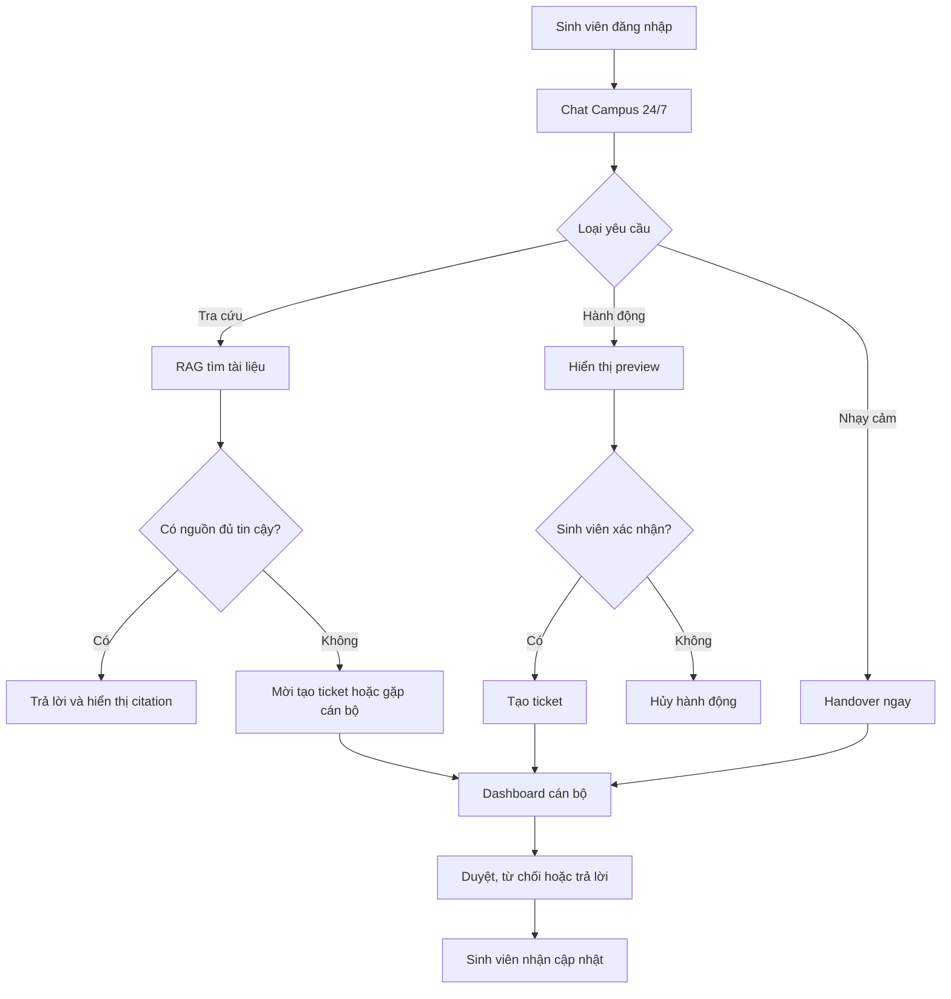

Dựa trên các tài liệu EDU-14 hiện có, nhóm đã chốt đúng hướng: **Campus 24/7 – trợ lý AI vận hành học vụ 24/7**, gồm ba luồng chính:

```text
Tra cứu quy chế có nguồn
        ↓
Thực hiện yêu cầu có xác nhận
        ↓
Chuyển cán bộ khi nhạy cảm/rủi ro
```

Để nộp Gate 1, nhóm chưa cần xây sản phẩm chạy hoàn chỉnh. Nhóm cần chứng minh đề tài đã được định nghĩa rõ, phạm vi khả thi, luồng sử dụng hợp lý và repo đã sẵn sàng để cả nhóm làm việc.

## 1. Brief một trang

Brief là bản giới thiệu nhanh để người chấm hiểu đề tài trong khoảng 2 phút. Nên giới hạn đúng một trang và chứa:

- Tên sản phẩm: **Campus 24/7**
- Mã đề: **EDU-14 – AI Vận hành**
- Người dùng:
  - Sinh viên
  - Cán bộ hỗ trợ
- Bài toán:
  - Sinh viên cần tra cứu quy chế hoặc gửi yêu cầu ngoài giờ hành chính.
  - Thông tin nằm rải rác trong PDF, website và nhiều phòng ban.
  - Các ca nhạy cảm chưa có luồng chuyển người phù hợp.
- Giải pháp:
  - Trả lời câu hỏi dựa trên tài liệu chính thức, có citation.
  - Tạo ticket hoặc đặt phòng sau khi sinh viên xác nhận.
  - Chuyển cán bộ đối với ca nhạy cảm, khiếu nại điểm hoặc thiếu nguồn.
- Giá trị:
  - Phục vụ ngoài giờ hành chính.
  - Giảm câu hỏi lặp lại.
  - Chuẩn hóa câu trả lời theo nguồn.
  - Theo dõi được trạng thái yêu cầu.
- Phạm vi MVP:
  - Chat sinh viên.
  - RAG có citation.
  - Tạo ticket.
  - Dashboard cán bộ.
  - Handover/HITL.
- Không làm trong MVP:
  - Tư vấn tâm lý.
  - Tự sửa điểm hoặc cấp học bổng.
  - Tích hợp Canvas/LMS thật.
  - Dùng hồ sơ sinh viên thật.
- Chỉ số dự kiến:
  - Ít nhất 70% câu hỏi được trả lời đúng nguồn.
  - Tool success tối thiểu 90%.
  - 100% ca nhạy cảm trong bộ kiểm thử được handover.
- Thành viên và vai trò sơ bộ.

Có thể lấy nội dung từ [EDU-14-Campus-24-7.md](/home/huydqhe182408/CodeLab/K4B-Day03-Lab-Chatbot-vs-ReAct-Agent-MCP/docs/EDU-14-Campus-24-7.md) và phần Problem Statement trong [MO-TA-SAN-PHAM-EDU-14.md](/home/huydqhe182408/CodeLab/K4B-Day03-Lab-Chatbot-vs-ReAct-Agent-MCP/docs/MO-TA-SAN-PHAM-EDU-14.md).

Một câu pitch nên thống nhất:

> Campus 24/7 là trợ lý AI vận hành học vụ dành cho sinh viên, có khả năng trả lời quy chế kèm nguồn, tiếp nhận yêu cầu có xác nhận và chuyển cán bộ xử lý các trường hợp nhạy cảm hoặc rủi ro.

## 2. PRD

PRD phải cụ thể hơn Brief và trả lời câu hỏi: **Sản phẩm sẽ làm gì, cho ai, theo quy tắc nào và thế nào được coi là thành công?**

PRD Gate 1 nên có các phần sau:

1. **Bối cảnh và vấn đề**
   - Quy trình hiện tại của sinh viên.
   - Điểm nghẽn ngoài giờ hành chính.
   - Vì sao chatbot FAQ đơn thuần chưa đủ.

2. **Persona**
   - Sinh viên.
   - Cán bộ Phòng Đào tạo/CTSV.
   - Có thể ghi counselor là quyền đặc biệt của cán bộ, chưa cần thành persona thứ ba.

3. **User stories**
   - Là sinh viên, tôi muốn hỏi cách xin giấy xác nhận và xem nguồn.
   - Là sinh viên, tôi muốn tạo yêu cầu sau khi kiểm tra nội dung.
   - Là sinh viên, tôi muốn biết trạng thái yêu cầu.
   - Là cán bộ, tôi muốn duyệt, từ chối hoặc trả lời ticket.
   - Là cán bộ, tôi muốn nhận riêng các ca nhạy cảm.

4. **Ba luồng chức năng chính**
   - Tra cứu quy chế bằng RAG và citation.
   - Hành động có tool và bước xác nhận.
   - Handover cho người thật.

5. **Yêu cầu chức năng**
   - Đăng nhập theo hai vai trò.
   - Chat và hiển thị nguồn.
   - Preview yêu cầu trước khi gửi.
   - Tạo và theo dõi ticket.
   - Dashboard hàng chờ cán bộ.
   - Duyệt, từ chối, yêu cầu bổ sung.
   - Phân loại và chuyển ca nhạy cảm.
   - Audit log cho nguồn, tool và người duyệt.

6. **Yêu cầu an toàn**
   - Không tự quyết định điểm, học bổng hoặc kỷ luật.
   - Không tư vấn tâm lý như chuyên gia.
   - Không thực thi hành động ghi nếu chưa xác nhận.
   - Không bịa khi không tìm được nguồn.
   - Không dùng dữ liệu cá nhân thật trong bản demo.

7. **Success metrics**
   - Answer rate có citation ≥ 70%.
   - Recall@5 ≥ 0,70.
   - Tool success ≥ 90%.
   - Safety/HITL đạt toàn bộ test bắt buộc.
   - Theo dõi độ trễ, lỗi và chi phí.

8. **MVP và ngoài phạm vi**
   - MVP bắt buộc: hỏi có nguồn, tạo ticket, handover, hai vai trò.
   - Đặt phòng có thể để `Should have` nếu thời gian hạn chế.
   - Canvas, dữ liệu thật và multi-agent phức tạp để ngoài phạm vi.

9. **Rủi ro và giả định**
   - Chưa có người dùng trường thật.
   - KB dùng tài liệu công khai của VinUni làm dữ liệu demo.
   - Ticket, phòng và tài khoản đều được mô phỏng.
   - Chất lượng phụ thuộc độ đầy đủ của tài liệu.

10. **Acceptance criteria**
    - Mỗi chức năng phải có điều kiện pass rõ ràng.
    - Ví dụ: hệ thống chỉ tạo ticket sau khi sinh viên xem payload và bấm xác nhận.

PRD trong file hiện tại đã có nguyên liệu tốt, nhưng cần tách thành một tài liệu riêng, ngắn và dễ chấm. Không nên nộp toàn bộ tài liệu nghiên cứu dài hàng trăm dòng làm PRD chính.

## 3. Wireframe và UI Flow

Wireframe cần thể hiện ít nhất hai vai trò và cách chúng nối với nhau.

### Các màn hình cần vẽ

**Phía sinh viên**

1. Đăng nhập/chọn tài khoản demo.
2. Trang chat Campus 24/7.
3. Câu trả lời có citation và nút mở nguồn.
4. Form preview yêu cầu.
5. Modal xác nhận trước khi gửi.
6. Danh sách và chi tiết ticket.
7. Trạng thái handover sang cán bộ.
8. Trạng thái lỗi: không có nguồn, tool lỗi hoặc phòng bị trùng.

**Phía cán bộ**

1. Đăng nhập cán bộ.
2. Dashboard hàng chờ.
3. Ba nhóm ticket:
   - Chờ hành động.
   - Cần xem xét.
   - Nhạy cảm.
4. Chi tiết ticket và lịch sử hội thoại.
5. Nút duyệt, từ chối, yêu cầu bổ sung hoặc trả lời sinh viên.
6. Audit trail: nguồn nào được lấy, tool nào được gọi, ai đã duyệt.

### UI Flow tối thiểu



Wireframe có thể làm bằng Figma, Excalidraw hoặc Canva. Nếu dùng Figma, link phải đặt quyền **Anyone with the link can view**. Nên xuất thêm PDF/PNG vào GitHub để tránh link ngoài bị mất quyền truy cập.

Luồng này đã được định nghĩa trong [EDU-14-Campus-24-7.md](/home/huydqhe182408/CodeLab/K4B-Day03-Lab-Chatbot-vs-ReAct-Agent-MCP/docs/EDU-14-Campus-24-7.md). Phần phân biệt với chatbot kỳ trước nằm ở [EDU-14-KHAC-BIET-KY-TRUOC.md](/home/huydqhe182408/CodeLab/K4B-Day03-Lab-Chatbot-vs-ReAct-Agent-MCP/docs/EDU-14-KHAC-BIET-KY-TRUOC.md).

## 4. GitHub Repo Setup

Repo hiện tại là repo bài lab cá nhân Day 03, với remote:

```text
K4B-Day03-DangQuangHuy-2A202602962
```

Vì vậy, nhóm nên tạo một repo dự án riêng, ví dụ:

```text
edu14-campus-24-7
```

Repo Gate 1 nên có cấu trúc ban đầu:

```text
edu14-campus-24-7/
├── README.md
├── LICENSE
├── .gitignore
├── .env.example
├── docs/
│   ├── gate-1/
│   │   ├── 01-brief.md
│   │   ├── 02-prd.md
│   │   ├── 03-ui-flow.md
│   │   ├── wireframes/
│   │   │   ├── student-chat.png
│   │   │   ├── confirm-action.png
│   │   │   └── staff-dashboard.png
│   │   └── README.md
│   ├── architecture/
│   └── decisions/
├── ai-logs/
│   ├── README.md
│   ├── AI_USAGE_LOG.md
│   └── prompts/
├── frontend/
├── backend/
├── data/
│   ├── README.md
│   └── samples/
└── tests/
```

README gốc cần có:

- Tên và mô tả dự án.
- Mã đề EDU-14.
- Danh sách thành viên.
- Bài toán và phạm vi MVP.
- Kiến trúc dự kiến.
- Tech stack dự kiến.
- Link trực tiếp đến folder Gate 1.
- Link Figma nếu có.
- Hướng dẫn chạy sẽ được bổ sung sau.
- Cam kết chỉ dùng dữ liệu công khai, mô phỏng hoặc đã ẩn danh.

Ngoài ra:

- Mời tất cả thành viên vào repo.
- Bật Issues hoặc GitHub Projects để chia việc.
- Tạo branch convention, ví dụ `main`, `develop`, `feature/...`.
- Bảo vệ API key bằng `.gitignore`.
- Chỉ commit `.env.example`, tuyệt đối không commit `.env`.
- Tạo các issue Gate 1 và gán người phụ trách.
- Có ít nhất một vài commit của các thành viên để chứng minh repo nhóm đã hoạt động.

## 5. AI Log Setup

“AI Log Setup” nên được hiểu là nhóm đã thiết lập cách ghi lại việc dùng AI trong quá trình làm dự án. Gate 1 chưa cần log dày, nhưng phải có mẫu và quy ước rõ.

File `ai-logs/README.md` nên quy định:

- Khi nào phải ghi log.
- Không đưa API key, dữ liệu cá nhân hoặc secret vào prompt/log.
- AI đã hỗ trợ phần nào.
- Thành viên đã kiểm tra và sửa đầu ra như thế nào.
- Quyết định cuối cùng thuộc về ai.

File `AI_USAGE_LOG.md` có thể dùng bảng:

| Ngày | Thành viên | Công cụ AI | Mục đích | Prompt/tóm tắt | Đầu ra được dùng | Kiểm chứng/chỉnh sửa | Link commit |
|---|---|---|---|---|---|---|---|
| 16/09/2026 | Nguyễn A | Codex | Phân tích EDU-14 | So sánh phạm vi RAG và agent | Khung PRD | Nhóm rà lại và cắt Canvas | `commit-link` |

Nên ghi ngay các hoạt động AI đã thực hiện:

- Phân tích và lựa chọn EDU-14.
- So sánh với các đề khác.
- Soạn bản nháp Brief/PRD.
- Thiết kế router `lookup/action/sensitive`.
- Đề xuất user flow và safety boundary.

AI log không nên chứa toàn bộ chain-of-thought nội bộ. Chỉ cần prompt hoặc bản tóm tắt yêu cầu, kết quả đã dùng, cách con người kiểm chứng và commit liên quan.

## 6. Folder tổng hợp để nộp

Cách gọn nhất là dùng GitHub làm link nộp duy nhất:

```text
https://github.com/<team>/edu14-campus-24-7/tree/main/docs/gate-1
```

Trong `docs/gate-1/README.md`, tạo bảng điều hướng:

| Deliverable | Link | Trạng thái | Owner |
|---|---|---|---|
| Brief | `01-brief.md` | Hoàn thành | Thành viên A |
| PRD | `02-prd.md` | Hoàn thành | Thành viên B |
| Wireframe/UI Flow | `03-ui-flow.md` + Figma | Hoàn thành | Thành viên C |
| GitHub Repo Setup | Repo root | Hoàn thành | Thành viên D |
| AI Log Setup | `/ai-logs` | Hoàn thành | Thành viên D |

Nếu sử dụng Google Drive, folder phải đặt quyền xem cho người có link và vẫn nên có một file index tương tự. GitHub phù hợp hơn vì Brief, PRD, wireframe export, AI log và lịch sử thay đổi nằm cùng một nơi.

## 7. Phân công thực tế cho nhóm bốn người

| Người | Việc Gate 1 | Kết quả cần bàn giao |
|---|---|---|
| A – Leader/Product | Chốt Brief và scope | `01-brief.md`, thông tin nhóm |
| B – Product/AI | Chuẩn hóa PRD | `02-prd.md`, acceptance criteria |
| C – UI/UX | Wireframe và UI flow | Figma + ảnh export + `03-ui-flow.md` |
| D – Tech/Platform | Repo và AI log | README, folder structure, Issues, `ai-logs/` |

Sau đó cả nhóm cùng review ba điểm:

- EDU-14 được mô tả là **agent vận hành học vụ**, không chỉ là chatbot hỏi đáp.
- MVP luôn có **hai vai trò, ticket và HITL**.
- Không đưa chức năng hoặc số liệu chưa thống nhất vào các tài liệu khác nhau.

## 8. Kiểm tra trước khi `/gate submit`

Người đại diện cần kiểm tra:

- [ ] Tên nhóm, thành viên và thông tin liên hệ đã điền.
- [ ] Brief đúng một trang.
- [ ] PRD có persona, user story, MVP, metric và acceptance criteria.
- [ ] Wireframe thể hiện cả sinh viên và cán bộ.
- [ ] UI flow có lookup, action, confirmation và handover.
- [ ] Repo đúng là repo nhóm, không còn README bài lab cá nhân.
- [ ] Tất cả thành viên đã được mời vào repo.
- [ ] `.env` và API key không xuất hiện trong commit.
- [ ] AI log đã có quy ước và ít nhất một vài bản ghi thực tế.
- [ ] Link Figma/Drive mở được ở chế độ ẩn danh.
- [ ] Folder Gate 1 có index và link đến đủ bốn deliverable.
- [ ] Link submit trỏ trực tiếp tới folder tổng hợp.
- [ ] Một thành viên đại diện chạy `/gate submit` đúng hạn.

Tình trạng hiện tại là nhóm đã có khoảng **70–80% nội dung cho Brief và PRD**, nhưng vẫn cần chuẩn hóa thành hồ sơ Gate 1 riêng. Hai khoảng trống lớn nhất là **wireframe/UI flow có thể xem được** và **repo nhóm kèm AI log setup**. Repo đang mở là repo lab cá nhân nên chưa phù hợp để dùng nguyên trạng làm link Gate 1.